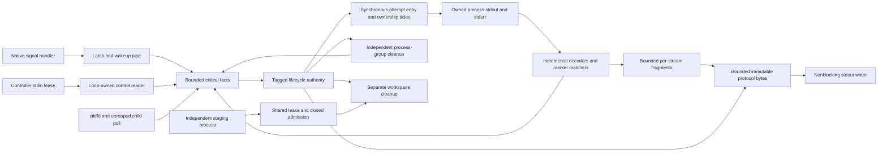

# Controller lease at real Unix boundaries

## Decision

**A — proceed with Candidate-3 production redesign**, subject to a separately
reviewed implementation plan. This branch changes no production or normative
contract. The evidence supports replacing helper lifecycle decisions and the
internal session protocol; it does not support discarding tested physical
ownership, workspace, deployment, forwarding, or RTT machinery.

The decisive simplification is removal of a distributed ordering obligation
that does not serve the product: a separately recognized shutdown no longer
has to defeat remote READY or retry. Local cancellation revokes dependent
launch. Remote termination revokes attempt entry. Real EOF eventually connects
those decisions, with independent cleanup on each side. No success fence,
control-prefix copy, hold acknowledgement, or reconciliation recursion is
needed in this slice.

Tagged states survived attachment to actual subprocess creation, reaping,
readiness decoding, signals, output backpressure and workspace exclusion.
They improve where ownership and eligibility are expressed, rather than making
Unix interruption or network failure disappear. The conclusion is architectural
and conditional: actual OpenOCD/GDB/service integration remains to be ported
and validated before replacement is suitable for users.

## Evidence and compatibility boundary

The audit in [REQUIREMENTS_AUDIT.md](REQUIREMENTS_AUDIT.md) preceded protocol
implementation. Sources are corrected main `ce12b6a`, the unchanged SRS and
protocol, and Zephyr 4.4.0 checkout commit
`684c9e8f32e4373a21098559f748f06915f950c9`, especially
[OpenOCD runner](https://github.com/zephyrproject-rtos/zephyr/blob/684c9e8f32e4373a21098559f748f06915f950c9/scripts/west_commands/runners/openocd.py)
and [runner core](https://github.com/zephyrproject-rtos/zephyr/blob/684c9e8f32e4373a21098559f748f06915f950c9/scripts/west_commands/runners/core.py).
The stock core launches the server for local GDB, preserves GDB's SIGINT
interaction, and terminates/waits for its server in cleanup. Flash uses a
one-shot checked invocation. These are behavioral references; they do not
prove target functionality in a stand-in experiment.

| Category | Preserve or permit |
| --- | --- |
| Product | Functional inherited options/argv; local GDB and symbols; flash result; debug versus attach initialization; foreground debugserver; RTT setup/client phases; useful incremental output; attempted argv; interruption cleanup |
| Safety | No new dependent launch after local cancellation; no attempt entry after remote termination; continuous resource custody; settled prior attempt before retry; genuine result provenance; monotonic primary; independent cleanup |
| Remote necessity | SSH and staging; loopback allocation; forwarding; explicit remote startup evidence; separate local/remote transport-loss observation; eventual rather than instantaneous controller-loss cleanup |
| Policy | Required versus best-effort services; readiness markers; timeout determination's finite observation cut; safely repeatable retry classification; cleanup budgets |
| Redesignable mechanism | STOP spelling/command stream; PROCESS_STARTING lifecycle event; ERROR/SESSION_CLOSED split; pending-control shadow; recognized-prefix fence; queue choreography; exception notes as canonical outcome |
| Permitted race | Remote READY/retry before authority handles EOF; either shutdown or natural exit as initiating cause; unrelated unestablished failures may become primary in either order |

No YAML change, transport capability negotiation, STOP fallback, or new user
option is proposed. A compatible selected SSH command must preserve directional
EOF for the long-lived command. `-n`, `StdinNull`, wrappers that close both
directions, mandatory PTYs changing EOF, and detached/reparented helpers that
lose controller custody are unsupported transport patterns.

## Components and authority

`Runtime` is the one remote decision task. FD callbacks retain/submit facts and
output fragments; they never choose READY, retry or primary failure. Same-loop
spawn entry and adoption need no execution rendezvous queue or custody ACK.
Cleanup tasks return structured final results including explicit disposal proof.
Their original task result is retained; a response is not inferred from waiting
time or reconstructed from diagnostic precedence. The local `LaunchGate` and
`shutdown()` are separate authorities for local work and owned transport.
Local forwarding and local RTT do not become helper-owned resources.

| Component | Invariant location |
| --- | --- |
| `model.py` | Created/Starting/Active/Terminating/Closed contain phase-specific data; immutable outcome and nested diagnostics; primary append rule |
| `Runtime.account/drive/enter` | Terminal monotonicity; current generation; retry after settled cleanup; startup evidence candidate; actual-entry validation; one Closed snapshot |
| Root ticket registry | Popen result remains reachable before wrapper/descriptor/adoption setup; producer final response precedes disposal; old tickets survive retirement |
| `ProcessScope` | Reserve PGID with unreaped leader; TERM/KILL escalation; reap; independently close descriptors; explicitly unconfirmed residuals |
| `Stream` | Incremental UTF-8; bounded line matching; complete-line/EOF evidence; per-stream FIFO; bounded final kernel-prefix scan |
| `SignalCapture` | Native minimal latch; wakeup pipe; loop fact admission; narrowly mask handler installation/restoration |
| `ByteWriter` | Immutable FIFO byte admission, partial offsets, bounded memory, one original writer failure; no replay |
| Workspace lease | SH staging ownership, closing tombstone before EX removal, bounded unsuccessful wait, no interference with process cleanup |
| Local gate | Opening plus READY plus required forwards; cancellation/fatal observation revokes actual callback entry |
| Local shutdown | Directional EOF, finite coordination budget, owned transport escalation; timeout never proves remote disposal |

### Tagged-state result

`Starting` alone contains request, attempt, evidence, and provisional retry
failure. `Active` contains an owned child and retained attempt diagnostics;
`Terminating` contains outcome and retired attempt; `Closed` contains outcome,
frozen wire snapshot and residuals.
An Active readiness flag or Created child field cannot be expressed by these
constructors. Python still allows `Starting(Owned(stale_ticket))`; the generation
validation remains essential and has a mutation check. Tagged unions are not a
proof system or protection against arbitrary attribute mutation.

Physical/source state remains: decoder indices, partial bytes, writer offsets,
signal latch, pidfd/descriptor disposition, task completion, and parser grammar.
These fields record different obligations, not competing lifecycle decisions.
`Closed.snapshot` and `Closed.outcome` deliberately differ after delivery fails:
the former cannot be changed retrospectively; the latter retains local failure.
There is no second terminal flag beside phase. The root registry is new cost,
not something concealed by fewer enum values.

## Protocol and local commits

The experimental JSON-line grammar is `SESSION_CREATED`, one `START`, then a
controller-input lease. There are no valid later commands. Output is `ATTEMPT*`,
`READY?`, incremental `CHILD_OUTPUT*`, and at most one `SESSION_ENDED`.
Child output can precede READY or follow attempt diagnostics. Per-stream order
is preserved; cross-stream ordering is not promised.

`ATTEMPT` records immutable exact argv and generation. It is diagnostic, not a
phase transition. Entry validates Starting/Authorized/current generation,
locally admits ATTEMPT, registers a ticket, and calls real Popen synchronously.
No asynchronous command queue separates admission from attempted creation.
Failed output admission forbids Popen; failed Popen still has an ATTEMPT record.
This is a local admission guarantee, not a promise the peer received argv before
exec. A writer failure afterward cannot undo physical creation.

READY commits only for Starting/Owned/current generation, complete evidence,
and a final live-child poll, with successful local writer admission. It is not
an instruction to launch GDB. The local launch callback rechecks Opening,
readiness, forwards and cancellation/failure at actual entry.

Remote termination linearizes at `Runtime.terminate`, during fact accounting;
local cancellation linearizes at `LaunchGate.cancel`. Retry linearizes when a
provisional safe-startup failure and genuinely settled prior attempt become a
new Authorized generation. Attempt entry revalidates authorization. Already
admitted critical facts are accounted before decisions as a convenient local
rule; there is no claim about EOF not yet read by the authority's adapter.

`SESSION_ENDED` freezes trigger, independently observed child result, primary,
secondary diagnostics, and disposal confirmation. Retired retry failures retain
their genuinely observed attempt result in structured diagnostics; they do not
become the current attempt's result or an established primary failure. Closed
forbids subsequent protocol commitments. Writer admission/drain failure updates the local outcome
without another terminal event. A genuine OpenOCD failure can have confirmed
cleanup. A valid terminal result can coexist with nonzero helper/SSH status;
that status is an independent infrastructure failure, never a child result.
Retained child fragments, terminal admission and physical drain share one finite
output budget after resource cleanup. A transient full writer does not discard
the tail immediately. An oversized frame or exhausted budget is a local failure;
cleanup is already complete and cannot depend on peer output progress.

No cleanup wait result is relabelled as a natural OpenOCD exit.

`disposal_confirmed` is based on physical cleanup and workspace disposition,
not on absence of operation failure. It covers only resources this slice owns.
It is not an end-to-end delivery guarantee or a substitute for completing local
transport cleanup. Lease/tombstone reclamation is explicitly omitted here.

## Physical ownership and settlement

| Boundary | Custody and rollback |
| --- | --- |
| Before Popen | Registry contains producing ticket before effect entry; no process yet |
| Popen returned | Producer's original ticket holds Popen immediately, before scope/streams/adoption; descriptor or BaseException hook failure disposes through that ticket |
| Same-loop adoption | Validated current ticket becomes Starting/Owned synchronously; root registry retains recovery reachability before and after publication |
| Delayed producer response | Controlled producer seam retains real acquired process; supervisor cannot retry/close while response can still arrive |
| Termination before response | Termination and workspace/process cleanup scheduling may begin; ticket cleanup waits for genuine producer completion; later result is disposed, never adopted |
| Cleaned result | Worker cannot create/offer another resource; unsafe retry also requires successful old resource disposal, not merely producer quiescence |
| Failed cleanup deadline | Closed may record residual custody and failure; deadline is unsuccessful effort, not fictional disposal or permission to reuse |

Task completion proves quiescence here because the same-loop producer owns no
unjoined background worker. A cancelled coroutine wrapping a still-running
thread or independent process would need a different reliable final-response
contract; Task.done alone would not suffice.

The delayed producer seam is deliberately at a real returned Popen handle. It
exercises late custody/final response without introducing a thread-based spawn
algorithm. Default entry/adoption does not create a producer task. Cancellation
of the authority requests termination and continues cleanup; it does not cancel
a producer into assumed settlement. Controlled producer cancellation is caught
and produces a final response. Cleanup initiation can precede producer settlement;
retry and closure cannot.

Native handlers only latch, so they can run between Python bytecodes without
changing lifecycle or throwing KeyboardInterrupt through Popen/adoption.
No-await alone is not the reason this boundary works. Signal masking is needed
around partial handler/wakeup installation/restoration, and is restored before
child creation. Tests deliver real signals in the helper process and inside
synchronous handoff, and inject BaseException at return, scope acquisition,
before adoption and after adoption. They do not prove recovery from arbitrary
exceptions *inside* CPython's Popen constructor before a handle is returned,
foreign handlers, fatal process death, OOM, or arbitrary asynchronous thread
exceptions. Production must retain its physical spawn rollback protections;
those are not accidental decision complexity.

Process-group ownership keeps the leader unreaped via waitid(WNOWAIT) while
signalling the group. Linux pidfds provide exit handshakes. Controlled orphan
descendants are reaped using a scoped subreaper because this test host's init
cannot be assumed to reap them. Only owned group members are reaped. The
subreaper/pidfd/proc inspection is Linux-specific physical machinery and a
qualification cost, not a protocol improvement.

## Deadline determination without success fences

The timer seam expires a real deadline future. It does not inject a ready/exit
or timeout answer. Real timers use loop.call_later; tests use explicit expiry
while real bytes, FD EOF and child exit remain actual OS observations.

At determination, the authority scans each owned stream's finite FIONREAD
prefix, probes EOF nonblockingly, accounts resulting marker/source facts, and
polls the unreaped child. A final single-byte probe may include a racing byte.
This is an explicit policy cut, not a hard physical-time ordering guarantee.
Readiness can win if sufficient evidence is observed during this determination;
a reapable child defeats live-server readiness. Otherwise missing evidence
fails startup. Sources on another side of a network cannot be globally scanned.

Because these pipes have one loop-owned reader, no reader checkpoint/ACK is
necessary. Final scans bypass ordinary bulk-reader pause using reserved bounded
storage. Critical controller/signal/exit facts have separate finite admission
from bulk output and writer capacity. Output backpressure cannot block EOF
accounting or process cleanup. An indefinitely flooding source cannot extend a
final scan forever. The slice intentionally does not promise finding a marker
behind arbitrary unconsumed child output beyond that finite cut.

Tests cover actual boundary markers, child exit with ordinary exit observation
paused, output EOF, controller EOF and no observation. A controller EOF near the
deadline may initiate shutdown or lose to timeout; a marker/exit racing after the
finite scan may likewise lose. Those cases do not justify restoring control
recognition precedence.

## Shutdown, transport and workspace evidence

The real helper reads START from stdin, keeps observing input during startup,
then reads actual EOF and writes final stdout afterward. Configured
`SshCommand`/`ManagedSshProcess` runs use ordinary OpenSSH and ControlMaster through
an inetd server over pipes, generated scratch keys, no listener or lab host.
[TRANSPORT_CHECKED.json](TRANSPORT_CHECKED.json) records six checked cases:
pipe proxy, ordinary SSH and shared SSH, each intentional stdin closure and
unexpected client-process death. Reverse output survives intentional closure;
helper exit, workspace removal and child absence confirm cleanup after loss.
An unrelated operation and sharing master remain usable. This qualifies the
tested transport, not arbitrary wrappers or all SSH versions. The sandbox
required permission for the local ControlMaster Unix socket.

Local shutdown closes stdin and keeps reading final output. It continues
accounting the final reader even if exit notification wins first, within the
same coordination budget. It distinguishes no terminal result, final result,
transport status and disposal proof. On expiry it terminates/kills only the
owned transport and records uncertainty; remote EOF-triggered cleanup remains
independent. SIGKILL/reaping requires OS progress; no strict wall-clock promise
is made for an uninterruptible kernel operation.

Staging retains a real process-shared SH flock before validation; termination
publishes closed admission, waits for original child-disposal responses, then
seeks EX exclusion before removal. The child executes with the workspace as
its actual cwd. Inputs are retained while a producer or terminating child can
still use them. Unconfirmed disposal retains the dependent workspace with an
explicit failure; independent child cleanup never waits for the staging lock.
A separate process proves its workspace remains usable until it validates and
reports success under that ownership, releases the lease, and sends a release
receipt. Child cleanup completes while staging holds its lease.
A deliberately stalled stage causes bounded unsuccessful workspace cleanup;
workspace remains, admission stays closed, process cleanup still succeeds.
The controlled release FD is a fixture/runtime seam for one staging owner, not
a proposed new production staging protocol. General multi-operation waiting and
coordination reclamation should reuse the current physical workspace mechanism.

## Deliberately permitted histories

| History | Checked result |
| --- | --- |
| Local cancel, actual remote markers/READY, then real EOF | READY commits remotely; local actual launch callback rejects; helper cleans normally |
| Real EOF exists with control observer paused, old attempt settles, retry N+1 | Retry is allowed before remote authority knows termination; accounting EOF then cleans all tickets |
| Readiness candidates retained, controller EOF accounted, decision runs | No READY |
| Old attempt fails with producer still pending; EOF accounted; producer returns | No retry; late process disposed |
| Child exit and controller EOF both available, either dispatch order | Either trigger; genuine observed child return code retained; one terminal snapshot |
| Terminal snapshot, partial write or no terminal bytes, EPIPE | No replay/second terminal decision; local writer diagnostic retained |

Protocol v1 already permits natural versus requested closure after local STOP
initiation; that permission is retained, not claimed as eliminated machinery.

Benign nondeterminism is not orphaning, stale adoption, false producer
settlement, or status fabrication. Those remain rejected by tests and mutations.

## Comparison with corrected main

| Concern | Current main | Slice | Assessment / moved obligation |
| --- | --- | --- | --- |
| Phase and terminal intent | `_State` plus ending, close_reason, natural_returncode, multiple error fields | Tagged state with structured outcome | Important combinations become local; physical tickets still mutable |
| Readiness | `_ready()` drains/reconciles pending observations, shadow control/failures, signal and child; recursion guard | Evidence plus phase/generation/live poll and local admission | Recognition precedence and guard disappear under revised semantics; readiness policy remains |
| Retry | `_finish_attempt`, group/relay settlement, `_retry_commit_boundary` and producer hold fence | Settled prior ticket plus provisional safe failure becomes next generation | Fence disappears; settlement/classifier remains inherent |
| `_pending_control` | Original fact also available while blocked publishing to `_events` | Loop callback recognizes/admit without await into critical path | Shadow removed; parser still retains incomplete bytes |
| `_ControlFence` | Flush recognized producer prefix and hold until retry decision | None | Removed product overconstraint; not merely renamed |
| `_AsyncInput.checkpoint()` | Final reader/control checkpoints and final-deadline event | Sole-owned nonblocking stream prefix and child poll | Reader ACK removed; finite final-observation policy still required |
| `_pending_signum` | Native latch plus queue/checks at success boundaries | Native latch/wakeup, admitted Signal fact | Latch inherent; precedence comparisons removed; narrow install masks remain |
| `_observation_failures` | Task failure registry reconciled before readiness | FD adapter directly admits original typed failure independently of bulk | Shadow removed for these sources; worker exception reporting remains a boundary duty |
| Queue topology | Bounded shared observations, signal queue, control/observer shadows, output adapter | Bounded critical deque, per-stream buffers, byte writer | Extra channel separation/new cost; avoids bulk-to-control dependency |
| Child identity fencing | SupervisedChild identity compared against observations | Monotonic generation on markers/results/offers | Consolidated; generation alone never authorizes terminal-state entry |
| Protocol output | `_ProtocolOutput`, queued emits and drain/error handling | Immutable bytes, partial offsets, phase forbids post-terminal commitment | Same physical obligation; terminal snapshot separates delivery failures cleanly |
| Failure composition | operation/protocol/cleanup exception precedence and note retention | Monotonic primary plus nested secondary records | Decision composition simpler; boundary rendering still needed |
| Spawn/ownership | `_spawn_child` rollback, SupervisedChild, group reservation and ownership | Root ticket before Popen; synchronous tagged adoption; scope disposal | Root registry is new cost; physical constructor protections cannot be declared unnecessary |
| Cleanup | Structured task scope plus group/relay/workspace release deadlines | Independent cleanup tasks, explicit final responses, Closed residuals | Easier decision location; physical escalation and failed disposal remain |
| `_ForwardManager`, RTT `_connect` adoption | Separate local owners with pending resources and interruption protection | Intentionally absent | Leave physical owners separate; nothing here proves those duties disappear |
| Workspace/deployment | Active/session leases, closed admission, reclamation and secure staging | Real exclusion, controlled notification, retained tombstones | Exclusion retained; secure extraction/general wait/reclamation omitted, not simplified away |

See [DIFFERENTIAL_MATRIX.md](DIFFERENTIAL_MATRIX.md) for behavioral coverage and
[CHANGEABILITY.md](CHANGEABILITY.md) for five concrete extension sketches.

## Complexity accounting

| Class | Accounting |
| --- | --- |
| Eliminated | Post-START STOP grammar; recognized pending control precedence; control hold/fence IDs and ACK; readiness reconciliation recursion; terminal event split/exception precedence reconstruction |
| Consolidated | One phase-specific outcome; attempt generation checks; READY and retry eligibility in authority; single terminal snapshot; original source failure admission |
| Moved | Exact-byte delivery and capacity stay in writer; decoding and source failures stay in adapters; actual launch revocation stays local; custody/disposal stay in tickets/scopes |
| Inherent | Remote readiness and forward gate; native latch; partial startup custody; group cleanup/reaping; producer quiescence; finite observation policy; cleanup dependency between child and staged inputs; bounded unsuccessful cleanup; lost final result and transport status |
| New cost | Root ticket registry; separate bulk/critical storage; explicit residual/disposal reporting from original completion cells; one final output budget and capacity wait; frozen snapshot versus augmented local outcome; more tagged data constructors; Linux pidfd/subreaper qualification |
| Fixture-only cost | Manual deadline expiry, controlled returned-handle producer seam, handoff hooks, staging release FD, generated SSH inetd/mux setup, negative-mutation switch |

Compared with the previous experimental Supervisor, there is no success barrier
or effect command queue to revoke. Physical ownership is more substantial, but
it does not bring the discarded protocol fence back. Compared with main, the
improvement is change locality and fewer distributed obligations, not raw size.

## Omitted functionality and limits

Python's native path representation can contain surrogate-escaped bytes that
are not directly UTF-8 encodable. ASCII JSON escaping preserves exact argv
without allowing diagnostic serialization to abandon an owned workspace. This
is a boundary encoding obligation, not another lifecycle state. A real missing
executable with such a path exercises this failure path.

This is not a drop-in runner. It omits actual OpenOCD, Zephyr runner dispatch,
GDB/RTT clients, service/address allocation and reservations, dynamic retry argv,
preferred-address cache, forwarding startup and retained-master endpoint
validation, opaque Tcl safety validation, environment allow-list forwarding,
standalone helper packaging/deployment/version queries, archive extraction/path
security, general multi-stager waiting and tombstone/revision reclamation.
Complete client wire validation/status-check integration is also omitted; the
local slice implements the launch gate and coordinated shutdown boundaries.
Existing production tests validate much of that baseline; the stand-in does not
prove equivalent target effects or end-to-end debug/flash/attach/RTT behavior.

The test bind signature is a controlled "address already in use" failure;
production must preserve conservative generated-startup retry classification.
The prototype inherits the test environment into the stand-in. This is not a
proposal to bypass the existing forwarded-environment allow-list. Workspace
metadata intentionally remains in test-owned parents. A production port must
retain safe reclamation and standalone deployment, not silently leak artifacts.

Progress is conditional on loop scheduling, finite admitted source work,
producer final response, signalable/reapable owned processes, staging completion
or a reported unsuccessful cleanup deadline, and writer progress or drain
failure. Authority cancellation is handled; malicious cancellation of cleanup
tasks, SIGKILL of the helper, kernel hangs, arbitrary descendant escape into a
new process group, and network detection latency are not unconditional cleanup
guarantees. The local process is terminated by the bounded policy but that does
not certify anything about a disconnected remote machine.

## Next step

Prepare a production redesign plan around this lease grammar and tagged
lifecycle authority. Revise requirements at the product level using the audit,
then specify the internal wire contract and deployment compatibility together.
Reuse qualified physical subprocess/workspace owners where appropriate. Preserve
separate forwarding/RTT failure domains and stock interactive GDB behavior.
Use the differential matrix as acceptance gates, adding real OpenOCD and Zephyr
integration before cutover. Do not start another broad abstract-model iteration;
this branch's remaining gaps are concrete integration/physical qualification
work, not a reason to recreate recognition fences.

Exact checks and limitations are recorded in [VALIDATION.md](VALIDATION.md).
