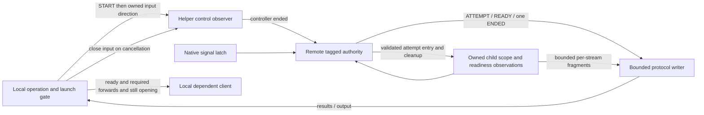

# Product-first session protocol experiment

## Recommendation

Recommend **Candidate 3: controller-lifetime lease**, with authority-linearized
remote decisions and a separate local cancellation/launch gate. Change the
internal protocol's ordering contract and terminal representation; do not
preserve Protocol v1's recognized-prefix success precedence. Keep explicit
readiness, pre-attempt diagnostics and physical ownership/settlement protections.

Real OpenSSH half-close and multiplexing work through the selected production
abstraction. Current main's deployment bootstrap already reads stdin to EOF
**before** returning its stdout response: `deploy_helper()` uses
`SshCommand.run(input_data=content)`, and BOOTSTRAP prints DEPLOYED only after
the read completes. Finite-input EOF followed by output is an existing runtime
obligation, not a hypothetical new capability to use as a reason for keeping
STOP. Existing long-lived helper control also needs streaming input and output
while stdin is open. The experiment verifies their combination.

SRS §2.8 does not spell out half-close separately; do not infer support merely
from executable basename or an abstract type signature. Keep it an explicit
transport-adapter obligation and validate supported wrappers at that boundary.
Candidate 2 is a fallback **if an otherwise supported transport demonstrates
a need for explicit close**, not the default solely for an imagined
incompatibility. It uses the same authority semantics and none of v1's
recognition fences. No new YAML key or mandatory probe is proposed.

This conclusion differs from merely simplifying the previous Python prototype:
the old invariant being removed is itself unnecessary for the modeled product
cancellation behavior. Neither the new wire spelling nor the tagged sketch is
a production implementation or a proof of whole-runner equivalence. No
production code, requirements, architecture/protocol documents, or previous
experiment files were changed. The branch is `experiment/product-semantics`,
based on `experiment/architecture-python` (`146debb`). Corrected main `ce12b6a`
is the comparison baseline; bug was not used as that baseline.

## Compatibility before protocol selection

[COMPATIBILITY.md](COMPATIBILITY.md) records the source/SRS analysis performed
first. It separates stock-compatible product behavior, remote necessities and
redesignable protocol mechanisms, with requirement references. The locally
available 4.4.0 checkout and public upstream source were inspected read-only.
RTT, semihosting console, interactive GDB Ctrl-C, optional forwarding, exact
pre-attempt argv and independent cleanup are part of the boundary, not omissions
to count as an architectural simplification.

The operation still has to feel like a local west runner: familiar commands and
options, local symbols/GDB, usable services, incremental diagnostics, ordinary
GDB interrupts, actionable failure and owned cleanup. SSH/staging/forwarding and
readiness necessarily add remote behavior. A total distributed ordering between
controller cancellation and remote success is not part of that experience.

## What is deliberately no longer ordered

Local cancellation commits when the **local operation authority** enters
Cancelling. A later READY cannot start GDB, an RTT client, or new dependent
forwarding work. Any already-running effect remains owned until cleanup/finality.
The remote helper observes termination at its **own authority**, when STOP,
EOF, signal, or a fatal result is accounted for. It then revokes unstarted work
and initiates cleanup. These are two separate linearization points, not a
cross-network instantaneous cancellation guarantee.

For candidates 2/3, parsing or retaining EOF/STOP in an observer has no special
precedence over the remote authority's READY/retry commit. Delivery must make
progress and must not sit behind bulk output forever, but no success barrier
has to prove that every producer's earlier recognized prefix was drained.
The helper can briefly complete readiness or commit an eligible retry before
it handles termination. Local cancellation still forbids new dependent work;
remote effects remain owned and are cleaned after remote observation.

This is not a promise to reverse a flash already in flight. Network observation
latency is inherent, and target writes cannot be rolled back by STOP. Address
collision retry must remain limited to a startup cause whose retry is safe,
with generated bind/service setup before dependent target work. A new retryable
cause needs that semantic justification, not just another error-code match.
Opaque fixed Tcl can have additional side effects outside the SRS's generated
startup-order guarantee.

The following races are intentionally permitted:

- Local cancellation, remote READY, later EOF observation, successful cleanup.
  READY is ignored locally; no functionality is lost by not suppressing it remotely.
- Natural OpenOCD exit racing requested shutdown. Either initiating cause may
  win at the remote authority. Preserve any genuinely observed natural child
  result separately; never invent one from shutdown/helper/SSH status. A nonzero
  natural exit established first fails; a late exit need not replace an already
  committed requested-shutdown outcome. Local cancellation is cancellation,
  not a claim that a flash completed successfully.
- An independent failure racing another failure before either is established.
  The first authority-established primary may differ by interleaving. Subsequent
  failure records are secondary. There is no wall-clock total ordering.
- A previously entered acquisition completing after termination. Its producer
  retains custody and disposes the late result; arrival alone is not adoption.
- A final result becoming undeliverable after terminal commitment. Local
  diagnostics grow, but no replacement terminal frame is sent.

A user note can say: “When shutdown and OpenOCD exit coincide, diagnostics may
report either as the initiating cause; cleanup is attempted in both cases.”
Synchronizing that winner would add no useful product guarantee.

## Candidate comparison

| Concern | 1: Protocol v1 | 2: authority START/STOP | 3: controller lifetime |
| --- | --- | --- | --- |
| Control | Ordered framed commands plus pending-recognition precedence | Ordered validated START/STOP; EOF also terminates; authority order only | START negotiation, then an open input direction denotes ownership; EOF terminates |
| READY | Reconcile recognized control, signals and observer failures before success | Validate actual policy/current attempt at authority; local Opening gate determines usefulness | Same as 2 |
| Retry | Cleanup plus recognized-prefix cut/fence | Internal helper retry after old producer/resource settlement and before authority termination | Same as 2 |
| Cancellation | STOP/EOF and a remote recognition cut | Local monotonic Cancelling; remote cleanup on authority observation | Same local rule; close stdin, retain output side |
| Signal | Native latch plus precedence/reentrancy considerations | Native safe notice; authority handles it; physical acquisition safety remains | Same as 2 |
| Timeout/final observation | Startup deadline determination and final reconciliation | Retain deadline determination and policy final observation; no unrelated control-prefix barrier | Same as 2 |
| Output | Lifecycle events including P1, byte-bounded writer and split terminals | Diagnostic ATTEMPT, READY, bounded per-stream relay, one structured terminal | Same as 2 |
| Ownership | Partial spawn/adoption rollback, child identity, group/relay cleanup | Keep producer custody, generation checks and proof of quiescence | Same as 2 |
| Transport cost | Deployment already uses EOF followed by response | Keep stdin until final result | Directional EOF obligation verified through actual abstraction; no post-START decoder |
| Hidden ordering cost | Pending control, retry fence, success reconciliation guard, shadow failure retention | No control cut, ACK/hold, or READY recursion required | Removes the post-START command parser as well; physical EOF watcher remains |

The START/STOP stream in 2 is tiny. It does not justify a generalized admission
framework. After START, a one-shot control observer can return STOP, EOF or
invalid-input failure as its original task result. Invalid input still fails
the session. The supervisor need not keep a second payload for lifecycle checks.
The preferred lease simplifies that task further: after START it waits for EOF
or unexpected data/failure, rather than interpreting more session commands.
Several already available commands may be handled as a batch, but preventing an
initial owned spawn between START and STOP is optional optimization here, not
a product invariant. They remain ordered within the control source.

Candidates 2 and 3 have identical checked product-state graphs in this model:
the difference is the control grammar and transport capability, not lifecycle
safety. Candidate 1 additionally forbids recognized-prefix success overtaking.
The model treats its cut as an abstract guard; its physical implementation costs
are established by corrected main and the previous experiments, not re-proved
by this product model.

## Protocol proposal, without editing Protocol v1

Keep an initial SESSION_CREATED-style allocation/contract result and one
validated START carrying the immutable process/service/readiness request.
Negotiation checks the concrete internal schema/capabilities; deploying matching
revisions does not justify acting on unvalidated input. Do not version
development history. After START, the preferred contract has no command stream:
stdin stays open while the client owns the session and EOF requests cleanup.
Candidate 2 can retain STOP for a demonstrated transport need.
No additional session commands have a demonstrated product need. Staging,
deployment and version probing remain separate SSH operations and lease scopes.

READY contains usable remote session information. The client stores it only
while Opening and starts dependent work only after required forwarding succeeds
and its local operation is still Opening with no established fatal observation.
If dependency launch crosses an asynchronous boundary, execution entry must
revalidate local state. Merely queuing launch before cancellation is insufficient.
Already running interactive GDB need not be asynchronously interrupted for a
session observation; the SRS allows action at the next status check after it
returns. A GDB-handled Ctrl-C is not the local cancellation event modeled here.

### Attempt diagnostics

| Option | Product assessment |
| --- | --- |
| Pre-spawn ATTEMPT with generation and exact resolved argv | Preferred. Analogous to stock's pre-command diagnostic. Describes an imminent attempt, not a successful child or lifecycle phase. Covers failed spawn and collision retry. |
| Post-spawn PROCESS_STARTED with argv/PID/address | Useful only if independently needed. Does not cover failed creation and cannot alone satisfy CONFIG-023's pre-spawn requirement. Adds another event without removing ATTEMPT. |
| READY success information plus argv in later failures/logging | Alone insufficient: argv is required before every attempt, including retries and spawn failure. Pre-spawn logging could substitute if it is incrementally available and unambiguously carries full argv. Then it is still an attempt diagnostic, just another channel. |

Use pre-spawn ATTEMPT in a bounded diagnostic/protocol stream. At actual effect
entry the authority validates current state/generation, locally admits the
immutable diagnostic, and enters the physical spawn without another scheduling
queue. Failed local admission means no spawn. This coupling remains because
CONFIG-023 requires it; removing lifecycle meaning from P1 does **not** remove
every physical entry/output obligation. Later delivery failure cannot undo an
attempt. Neither this proposal nor Protocol v1 can guarantee that the peer saw
the frame before the OS call during transport failure. No diagnostic ACK or
exactly-once delivery is proposed.

### Structured terminal result

One immutable SESSION_ENDED snapshot should contain an initiating trigger,
optional genuine child result, optional primary failure and ordered nested
secondary diagnostics. Its summary can classify failure when a primary exists;
keep the initiating trigger separately if helpful. The helper's generic EOF
trigger is `controller_ended`, **not** proof of user-requested shutdown. The
client already knows whether it intentionally closed or detected transport loss.
The remote helper does not need that distinction to choose cleanup.

The child's result has explicit provenance and attempt identity. SSH/helper exit
status is a separate infrastructure field/result, not a substitute returncode.
The client interprets the trigger in its local operation context: an unsolicited
helper signal/end or an unusable opening is failure, rather than silently treating
an absent child returncode as successful OpenOCD completion. Intentional local
shutdown remains distinguishable from lost transport on the client.
A leader exit does not settle descendants, relays, address/workspace ownership.
Failed cleanup makes the operation fail even after intentional shutdown. The
primary established operational failure remains primary; cleanup and later
writer failures remain secondary. If no earlier primary exists, infrastructure
or cleanup failure establishes one. No total precedence is imposed on unrelated
new failures.

Terminal commitment freezes one wire snapshot. Output admission, partial write,
complete local write and peer receipt are different stages. Delivery failure
is a retained local diagnostic; it cannot emit another terminal to report that
the terminal failed. Cleanup-failure details remain in the source's outcome
even if the terminal never reaches the client; broken transport cannot guarantee
their delivery or persistence after process loss. A cleanup timeout means a failed
attempt with retained residual responsibility; it does not prove quiescence.

### Output

Use bounded per-stream bulk storage and incremental fragments, including
newline-free data. Keep order within stdout and stderr, without promising a
cross-stream order. Reader backpressure is acceptable; unbounded retention or
silently discarding required console content is not. Readiness-relevant markers
become critical observations rather than staying buried behind bulk output.
Critical results/EOF/signal notification do not wait on a bulk channel.

The physical stdout pipe still shares network capacity for diagnostics and
session results. A separate logical queue does not guarantee prompt delivery
through a blocked SSH window. The authority must continue cleanup independently
of writer progress. Final output drain has a bounded attempt; its failure is
diagnostic. This is remote transport behavior, not a reason to block the
lifecycle authority on queue capacity.

## Formal evidence

[ProductSession.tla](ProductSession.tla) starts from local Opening/Active/
Cancelling/Ended and remote Created/Starting/Ready/Terminating/Ended. It is not
an extension/refinement of LifecycleOrdering. Two fenced attempts have
Authorized/Producing/Owned/Settled custody. A late producing result keeps
producer ownership; cleanup and finality are separate from stopping a wait.
Natural exit records the leader result but retains group cleanup ownership.
Failed disposal retains a live helper-owned residual after closure.

The three candidates differ only by the extra v1 recognition guard. Separate
recognized/admitted/handled controller loss exists to test that guard; it is
not a recommendation to keep those stages in the selected implementation.
Remote terminal observation is HandleLoss at the authority. START is abstracted
after validated allocation/negotiation, not a model of configuration bytes.

[OutputOrder.tla](OutputOrder.tla) separately checks two bounded per-stream
buffers, three fragments per stream and writer failure/finalization. This is
component-level evidence, not a proof of integrating arbitrary byte fragmentation,
native stream readers and the combined protocol writer. Lifecycle runs use
zero bulk fragments to keep their state graph focused; the protocol FIFO is
bounded at two entries. Cross-stream permutations are deliberately allowed.

[checked/SUMMARY.md](checked/SUMMARY.md) records 29 actual TLC results,
including four targeted clean histories, with spec/config/tool hashes and finite
graph counts. Passing configurations exhaust
their graphs; negated reachability properties produce real witness traces.
The model bounds two attempts, one final natural exit, one signal, one writer
failure, one independent observer failure, one local operation failure and at
most one cleanup result per attempt. Live-server configurations require readiness;
separate one-shot flash configurations accept successful process exit without
READY or a dependent client. Optional status is an empty/singleton sequence;
configurations check exit codes 0 and 7. These bounds do not establish an unbounded
proof or exhaustive production behavior.

| Product property | Checked mechanism |
| --- | --- |
| No new dependent client after local cancellation | LocalSafety checks actual launch audit and readiness/forwarding prerequisites. |
| Valid remote readiness | ReadinessHonest; policy evidence/current owned attempt; timeout determination accounts already established evidence. |
| No unsafe attempt/retry after authority termination | TerminalSafety and state guards; startup effects still authorized are revoked. |
| No stale mutation, unsafe retry or zero cleanup owner | NoStaleMutation, RetrySettled, ResourceOwned; final producer/cleanup settlement before next generation. |
| Established primary and all admitted cleanup failures retained | PrimaryPreserved, LocalPrimaryPreserved, DiagnosticsRetained; local and remote authorities have separate outcome state. Tagged tests additionally retain nested details. |
| Child status never fabricated from infrastructure status | ResultHonest and LocalResultHonest check provenance and received value. |
| Nonzero child exit established first fails; flash needs no server READY | ChildFailureRecorded and OneShotSafety, with zero/nonzero one-shot configurations. A later genuine result does not impose a different shutdown-race winner. |
| Closure accounts for producing tickets and owned resources | ClosureAccountsResources requires all attempts settled; failed cleanup retains an explicit owned residual. Cleanup may begin before a different producer settles. |
| One terminal decision, no later protocol decision | TerminalUnique and ProtocolClosed; nonterminal entry/READY actions require preterminal state. Terminal delivery is not commitment. |
| Bounded ordered output | OutputBoundedOrdered and separate BoundedOrdered; no cross-stream total order. |

Selected generated traces:

- [Late READY ignored, observed EOF, cleanup and clean final delivery](checked/benign-ready.md).
- [READY over withheld control](checked/authority-overtake.md) and
  [lease retry over withheld control](checked/lease-retry-overtake.md).
  These are permitted product histories, not candidate defects.
- [Requested shutdown wins](checked/benign-requested.md) and
  [natural exit wins](checked/benign-natural.md), both through cleanup and delivery.
- [Late acquisition remains owned through disposal](checked/benign-late-acquire.md).
- Deliberate defects: [late local launch](checked/late-client.md),
  [unsettled retry](checked/early-retry.md), [owner loss](checked/lost-owner.md),
  [stale adoption](checked/stale-adopt.md), [status fabrication](checked/status-mix.md),
  [primary replacement](checked/replace-primary.md),
  [diagnostic loss](checked/lost-diagnostic.md),
  [second terminal](checked/second-terminal.md),
  [attempt after termination](checked/terminal-attempt.md).

FairSpec checks TerminationCloses with weak fairness for controller admission,
revocation, pending acquisition completion, cleanup, terminal admission/delivery
and closure. These are explicit response/progress assumptions; physical cleanup
failure is also allowed and settles a failed attempt with retained residual.
Removing all fairness yields [stuttering termination](checked/unfair.md).
Keeping admission/output fairness but removing worker/revocation fairness yields
[an uncompleted worker](checked/workers-unfair.md). No unconditional remote
termination or bound on SSH/OS detection is claimed.

ProductHistories constrains scheduling of **the same ProductSession actions**,
not another lifecycle algorithm, to produce four clean witness histories.
Every product invariant plus HistorySound is checked before the intentional
NoCompleteWitness violation. Their terminal states have successful disposal,
no primary failure, no launched dependent client, and received final output.
The unrestricted witnesses can also include unrelated output failure; those
remain useful reachability evidence but are not presented as the clean benign
race examples. The history module schedules parent actions rather than implementing
a separate decision algorithm.

## Real transport feasibility

[transport.py](transport.py) exercised the actual production `SshCommand.popen`
and ManagedSshProcess stdout/stdin/stderr ownership path. Controlled local pipe
processes and **real OpenSSH client/server** were used; no remote lab/hardware,
OpenOCD, GDB, or forwarding endpoint was used. The server runs unprivileged in
inetd mode through ProxyCommand pipes with ephemeral scratch-only keys/config.
It creates no external network listener. Multiplexing uses an experiment-owned
master/socket, not any user's sharing master.

This verifies transport feasibility, not that closing stdin on the unchanged
v1 helper produces the proposed result. Current v1 EOF closure is silent; the
new helper/client contract must explicitly return/accept SESSION_ENDED on EOF.

[TRANSPORT_CHECKED.md](TRANSPORT_CHECKED.md) records six runs: intentional EOF
and unexpected client death over pipes, plain SSH, and multiplexed SSH. Every
run produced an independent cleanup receipt over a named pipe. Intentional EOF
preserved final stdout and stderr before/after EOF. Abort tests deliberately did
not rely on receiving a final protocol frame. The sharing master remained alive,
and another SSH command worked while its controller lease was open. Closing
the master session completed its own final stdout handshake and cleanup.

The final receipt proves the controlled peer observed controller EOF and ran
its cleanup step, not that arbitrary OpenOCD descendants would be killed. This
experiment tests transport assumptions at the real abstraction boundary;
physical process cleanup remains main's separate obligation. Handshakes use
pipes, complete lines and SSH session readiness, not sleeps or elapsed-time
assertions. The generous 30-second timeouts only detect a failed experiment.

[RFC 4254 §5.3](https://www.rfc-editor.org/rfc/rfc4254#section-5.3)
defines channel EOF as ending one data direction while the other may continue.
That supports the measured OpenSSH result. OpenSSH's
[channel implementation](https://github.com/openssh/openssh-portable/blob/V_10_0_P1/channels.c)
handles input EOF separately from output; its
[multiplexer](https://github.com/openssh/openssh-portable/blob/V_10_0_P1/mux.c)
handles individual session descriptors/control closure. The tested binary
version is recorded separately; those pinned sources explain the mechanism,
not exact identity with the installed build.

The [ssh manual](https://man.openbsd.org/ssh.1) documents stdin suppression
with -n and connection-sharing controls. A lease/START transport must actually
carry stdin: -n/StdinNull, forced PTY, detached command wrappers, inherited write
descriptors, or wrappers that close both directions can defeat the intended
contract. PTY semantics should not be used for the machine helper channel.
Do not infer capability merely from executable basename or assume all compatible
commands are OpenSSH. Intentional stdin close leaves the process/readers owned;
unexpected SSH death records a local transport failure. Neither proves the
remote detection time. A broken network may prevent any final result; ownership
and cleanup on each side remain independent.

Staging/deployment are separate SSH subprocesses: keep the helper controller's
input open while they run. EOF applies to that session channel, not the master
or other commands. External retained forwards still need the existing
ownership/endpoint rules; the experiment does not cancel them or alter
connection-sharing policy.

## Tagged-state representation and change locality

[tagged.py](tagged.py) is an executable **decision sketch** for the leading
lease's authority semantics; candidate 2 normalizes STOP to the same fact.
It has Created, Starting(attempt, required evidence, provisional failure),
Active(Owned child), Terminating(attempt, outcome), and Closed(outcome,
residuals). Attempts are Authorized, Producing, Owned and Settled variants.
Local Opening has readiness/forwarding evidence; Cancelling has an outcome
and no launch eligibility. Frozen data and union narrowing make phase-specific
fields explicit without inheritance or a large class hierarchy.

Its tests cover both readiness prerequisites, late local READY, termination
revocation, pending-producer closure/retry rejection, generation fencing,
both benign shutdown/exit winners, group cleanup after leader exit, diagnostic
ordering, nested cleanup, post-terminal writer failure and successful/failing
one-shot flash exits. This sketch does
not reproduce the previous asyncio adapter. In particular, returning an
ATTEMPT plus spawn command does **not** implement atomic local admission/entry.
Observation `producer-final` must mean real quiescence plus an owned transfer,
not a timeout or a function returning a bare handle. Those boundaries remain
the runtime's job. String handles are experimental identity tokens.

Compared with ControlSession and the previous Supervisor, readiness candidate,
retry eligibility and terminal intent are no longer freely combinable phase
booleans. Terminating cannot carry a readiness field, Active requires an Owned
child, and Closed retains residual responsibility. Starting still has legitimate
substates/evidence/provisional data; union types alone cannot enforce every
relationship. Python annotations do not prevent a caller constructing a wrong
variant at runtime, prove linear ownership, or protect native reentrant signal
delivery. Transition factories, narrowed authority APIs and physical scopes
remain necessary; adding a class for every flag would obscure rather than help.

| Change | Main / prior Python under v1 | Candidate 2/3 locality |
| --- | --- | --- |
| New readiness condition | Observation/marker source, readiness validation and success reconciliation; prior prototype adds evidence while retaining shared barrier | Policy/evidence collector and Starting validation; local dependency gate unchanged. Native final observation policy still needs a seam. |
| New retryable startup cause | Classification, cleanup, retry boundary/fence; prior ticket settlement plus shared barrier | Classifier plus Starting provisional decision; common settlement/current-generation guards. Prove safe repetition, not just add an enum. |
| New fatal observer | Main guarded publication/shadow failure/reconciliation; prior reserved source/result plus accounting | Owned original final-result source and common outcome admission. No success fence registration; reserved retention remains necessary under backpressure. |
| New cleanup resource | Partial acquisition/adoption, independent cleanup, failure aggregation; prior owner cell/ticket/task accounting | Physical scope/owner and cleanup set; common diagnostic/finality rules. No global supervisor across local forwards/RTT/helper. |
| New diagnostic source | Exception/note reporting and output paths; prior immutable nested diagnostics | Typed diagnostic conversion and bounded local/output retention. Failure to deliver does not remove required local diagnostics. |

Hidden-state accounting is conceptual, not a misleading variable count:

| State equivalent | v1 main / previous Supervisor | Selected authority contract |
| --- | --- | --- |
| Consumed but unadmitted control | Shadow pending control / original prefix | Not lifecycle precedence state. Original observer result is retained until accounted; no second payload. |
| Pending signal | Native latch with final precedence checks / simulated mask seam | Native minimal latch still necessary; decision occurs at authority admission. Acquisition interruption remains physical. |
| Shadow failure | Guard dictionary / original task/Future results | Original final results owned by source tasks; diagnostic retention remains inherent. |
| Pending fence | Retry fence / shared epoch/hold/ACK | Removed for controller-success ordering. |
| Retry latch | Startup/error fields / retry + provisional | Starting provisional failure and Settled attempt eligibility; no retry data in Terminating. |
| READY reconciliation guard | `_ready()` recursion guard / generic barrier state | No recursive reconciliation needed with non-suspending authority decisions. |

Invalid-state surface:

- Terminal + READY/retry decision: blocked by state-specific transitions.
- Retry + unresolved producer: Producing is not Settled; no eligible transition.
- Stale result adopted as current: generation checked before state-specific handling.
- Live resource without owner: still possible in a broken physical adapter;
  typed decisions do not solve acquisition/handoff by themselves.
- Two cleanup actors believing exclusive custody: needs the single ownership
  cell/runtime protocol from the previous experiment; no new distributed ACK.
- Terminal followed by another committed frame: one frozen final decision and
  closed publication API; pending physical writes are not new decisions.
- Closed with a failed cleanup residual: legitimate, explicit failed cleanup,
  not successful disposal. Caller must retain/transfer the residual obligation.

## Complexity accounting and proposed boundary

**Disappears:** remote recognized-control precedence, `_pending_control` as a
second lifecycle-check payload, `_ControlFence`/hold/ACK for READY/retry,
controller-specific success reconciliation recursion, and split ERROR versus
SESSION_CLOSED outcome reconstruction. The preferred lease additionally
eliminates the post-START command parser.

**Consolidates:** one remote authority, generation validation, readiness/retry
eligibility, first-primary plus secondary data, and terminal publication.
Current main already has transition authority and ownership protections; these
are not newly discovered features.

**Remains:** native latching, physical acquisition/adoption rollback, process
groups/reaping, producer quiescence, startup final determination, bounded output,
local forwarding/RTT ownership, staging/workspace exclusion, best-effort versus
required failures and independent cleanup. No promise is removed merely because
its implementation is absent from this model.

**Moves:** cancellation relevance into the local Opening/launch gate; control
syntax into a small observer; byte/output failure into a writer; physical
custody into resource scopes. A local launch handed to an executor still needs
entry validation. Per-source retained results are real storage, not free facts.

**New costs:** tagged variants and transition factories; structured terminal
serialization/validation across helper/client; preserving original diagnostics
after wire failure; explicit transport EOF behavior and wrapper qualification.
Protocol migration needs coordinated fixtures/contract support. No new
half-close capability negotiation/probe is needed merely to restate the
directional EOF obligation already used by deployment.
A generalized revocable command queue and lease registry are not required by
the recommendation merely because previous experiments modeled them.

Suggested concrete boundary: a local session operation owns Opening/Active/
Cancelling and dependent-launch permission; a remote supervisor owns tagged
helper state and attempt scopes. A control task returns START and later one
termination/validation result; a signal adapter posts minimal native notice;
owned child/reader tasks retain final results; readiness policy supplies facts;
a bounded writer relays diagnostics/output/final snapshot independently.
Same-loop effect entry/adoption can call non-suspending authority methods.
Actual blocking/native acquisition may need a separate physical scope, but not
an extra lifecycle decision owner. Bulk readers and writer need independent
progress. Local forwarding and RTT remain separate failure domains.



The control/signal adapters retain original notices until accounted. The authority
alone chooses phases, retry and primary outcome. The child scope owns partial
acquisition and finality. The writer owns physical output progress and its original
failure result. The local gate alone authorizes dependent launch. Forwarding and
RTT owners are deliberately outside the remote scope in this diagram.

| Current main mechanism | Proposed treatment and remaining obligation |
| --- | --- |
| `_events` and child output observations | Separate bounded bulk relay from critical original task results/EOF notices. Critical retention and fair admission remain; no unbounded queue is assumed. |
| `_pending_control`, `_ControlFence`, `_AsyncInput.checkpoint()` | Remove the control-recognition success cut and its payload shadow/hold handshake. A one-shot EOF watcher retains its original result. Final readiness/deadline policy observation is still required; removing a control checkpoint does not remove that different obligation. |
| `_pending_signum` | Keep a safe native latch. Authority admission decides termination; reentrant interruption protection around physical acquisition remains outside tagged decisions. |
| `_observation_failures` | Retain original owned task/result failures rather than duplicate lifecycle payloads. A writer/observer failure must still be accounted and reported despite bulk/output backpressure. |
| `_ready()` reconciliation and retry commit | State-specific eligibility/current generation plus local launch gate; no remote control-prefix barrier. Still validate actual readiness and old-attempt settlement before retry. |
| Child identity and `SupervisedChild` | Generations prevent stale mutation; process scope/group/relay ownership still provides physical safety. A leader exit alone is not settlement. |
| `_ProtocolOutput` | Preserve byte bounds, FIFO framing, partial-write handling and bounded final drain. ATTEMPT is diagnostic; one structured final snapshot removes frame-precedence reconstruction. |
| `_spawn_child()` | Keep interruption-safe producer ownership and same-loop adoption. ATTEMPT admission immediately before actual execution remains because attempted argv is a product requirement. |
| Pending-forward ownership and RTT socket adoption | Leave in their separate local failure domains. Shared outcome/ownership concepts may help later; neither is absorbed into the helper authority. |
| Cleanup deadlines | Retain bounded best-effort attempts, secondary failures and residual responsibility. Stopping a wait does not prove that an acquisition can no longer return a resource. |

Next step is a concrete candidate-3 boundary prototype/differential evaluation
against main's user-visible session behavior, especially queued failures at local
launch, timeout final scans, group/relay finality, staging exclusion and output
failure. The product decision is now explicit; another abstract-model iteration
is not the default. No production refactor is started by this experiment.

Intentionally omitted implementation behavior includes actual argv/address
regeneration on retry (the tagged example preserves a sample tuple), protocol
byte/schema decoding, real readiness marker/final-scan policy, process-group
kill/reap/relay joins, runtime native signals/cancellation, forwarding/RTT,
staging locks and workspace removal. These cannot be counted as eliminated
complexity. Complete client status rendering and post-terminal SSH reaping/status
accounting are also runtime integration obligations, not implemented by the
decision sketch. The transport peer's cleanup receipt is not an OpenOCD cleanup test.

## Validation

The final sources produced 29 expected TLC results, 15 passing tagged-state tests
and six successful transport cases. The ordinary repository pytest suite passed
all 701 tests. The mandatory static check passed, including Ruff, mypy, Pylint,
Python-version checks, schema checks and Markdown lint. These checks do not
exercise external SSH/Zephyr integration or hardware profiles. Formal checks
are finite-state evidence; transport checks establish the measured local OpenSSH
capability rather than every possible configured wrapper.

## Reproduce

```sh
.venv/bin/python experiments/lifecycle/product_protocol/check.py \
  --jar .scratch/agents/architecture-ordering/tla2tools.jar
.venv/bin/python -m pytest experiments/lifecycle/product_protocol/test_tagged.py
PYTHONPATH=python .venv/bin/python experiments/lifecycle/product_protocol/transport.py --openssh
.venv/bin/python scripts/contributor/static_check.py
```

TLC jar/runtime and temporary keys, FIFOs, daemon logs and state graphs remain
ignored under scratch. Tracked checked files contain only generic experimental
results and projected model states. No credentials or lab inventory are stored.
SSH/Zephyr integration or hardware suites are not claimed by these checks.
