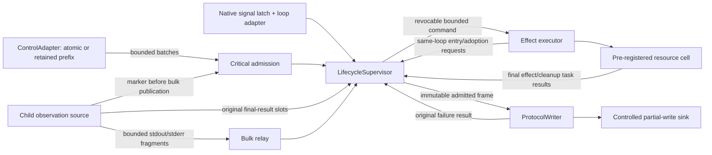

# Concrete asyncio lifecycle experiment

## Decision

**B. Adopt selected concepts incrementally.** Structured outcomes, an explicit
success commit, original-result retention, and same-loop resource cells improve
the clarity of particular lifecycle properties. This prototype does not justify
a wholesale production redesign. Current main already has one transition
authority, bounded output, child identity fencing, and owned cleanup. The
prototype's decision layer is easier to inspect, but its channels, result slots,
effect stages, and cancellation scopes introduce comparable boundary machinery
before most physical production behavior has even been implemented.

This is an experiment on `experiment/architecture-python`, based on refinement
commit `5082696`. The authoritative comparison is corrected main `ce12b6a`.
Production, SRS, SAD, Protocol v1, and all earlier experiments are unchanged.
No implementation-language comparison or production refactor is proposed here.

## Components and authority



The executable core is [session.py](session.py), [channels.py](channels.py),
[output.py](output.py), and [contracts.py](contracts.py). [fakes.py](fakes.py)
contains only physical seams: dispatch/acquisition/transfer/cleanup gates and
a partial-write sink. There are no real processes, sockets, SSH, clocks, or
hardware effects in the prototype tests.

Authority means **one owner object on one event loop**, with non-suspending
decision methods. The coordinator drains observations; executor tasks call that
same object's entry/adoption methods synchronously. This is not a single-task
actor whose every request takes an asynchronous mailbox round trip. Workers
never choose a phase, retry, terminal reason, primary failure, or protocol event.
They bind a physical result into their designated scope and return immutable
`Finished` data. Only supervisor methods change lifecycle decisions and cleanup
ownership. An off-loop worker cannot call these methods unchanged.

The runtime uses TaskGroup ownership. Completed effect/cleanup tasks retain
their original structured results; accounting metadata prevents replay. No
parallel exception-shadow dictionary is maintained. Final child exit/failure
sources have original one-shot Future slots allocated before effect entry.
Unexpected control exceptions become the control task's result; cancellation
joins/retrieves any unadmitted original batch. TaskGroup is not used to select
failure precedence.
Accounting here has a fixed order: original result groups, the signal latch,
critical FIFO, then bulk. The first committed primary/reason follows that
authority order. This is not a verified replacement for main's mixed-source
queue ordering when several new failure candidates are pending together.
Channel separation moves that policy into the coordinator; any production
proposal must preserve main's required precedence with differential coverage.

Snapshots, a backpressure handshake, and protocol/delivery journals support experiment assertions. They
are immutable observations or test traces, not proposed unbounded production
buffers. The runtime attempt list is bounded by `max_attempts` (two by default).

## State and implemented invariants

`Phase` is Created, Starting, Active, Retiring, or Closed. Retiring covers both
provisional startup failure and terminal intent; `Outcome.reason` distinguishes
them. Each attempt has a monotonic generation, effect stage, owned scope, worker
and cleanup task, and final-observation slots. Readiness is a boolean candidate.
A retryable failure remains provisional rather than becoming the primary
failure merely because retry might later be suppressed by STOP.

`Outcome` directly contains the first terminal reason, optional primary
`Diagnostic`, and ordered secondary diagnostics. Diagnostic details are nested
immutable records. Later cleanup/output failure does not replace an established
primary. Equal failure text is not globally deduplicated. ERROR text is rendered
at the compatibility boundary from a snapshot; later writer failure cannot
alter that already committed frame. No exception notes are canonical state.
The physical-seam converter snapshots legacy exception groups and attached
notes into immutable diagnostic details, including notes on nested failures.
Mutating the original exception afterward cannot change the outcome data.

| Component | Invariant it implements |
| --- | --- |
| Supervisor | Monotonic terminal intent; no READY/retry after intent; current eligibility/generation at success; immutable terminal wire decision; first primary retained. |
| Critical admission | Capacity is positive/bounded; loop-local recognition and admission have no suspension; credit is released by coordinator drain. |
| Prefix ControlAdapter + SuccessBarrier | Original recognized prefix survives blocked/cancelled publication; ordered batch handling; no renewed recognition while held; matching proposal/epoch; commit or abort releases the hold. |
| Effect entry | Generation, phase, intent, and stage revalidated at actual entry; local PROCESS_STARTING admission immediately precedes running/begin; ordinary admission failure prevents the effect. |
| ResourceOwner | Designated producer ownership before acquisition; one authoritative owner cell; supervisor reference exists before transfer; publication never removes producer responsibility before supervisor responsibility exists. |
| Owned effect tasks | Cancellation of the wait leaves the physical production task owned; final response joined before settlement; producer disposes an unadopted late result. |
| Original result slots | Already recognized child exit/failure and writer failure do not need critical-mailbox or output capacity; supervisor accounts them before success. |
| ProtocolWriter | FIFO immutable frames; bounded queued/in-flight credit and bytes; partial write separate from completion; one retained original failure; no replay after failure. |

Python privacy is a convention, not static enforcement of ownership. The loop
serialization contract also excludes arbitrary callers mutating public fields
or calling these methods from other threads. Tests use normal construction and
public observation/effect seams, not handcrafted supervisor state.

## Control recognition and the generic success boundary

The fake input seam accepts bounded LF-delimited START/STOP tokens, EOF, and
invalid tokens. It is **not** a replacement Protocol v1 JSON command decoder.
Complete batches contain at most 32 frames; reads are at most 1024 bytes.
Framing errors become immutable protocol-failure facts. The omitted production
decoder does not change the lifecycle ordering tested here.

### Strategy A: loop-local recognition/admission

`Admission.publish()` waits for a free bounded slot before calling its
recognizer. Checking credit, converting buffered input into complete facts, and
`put_nowait()` happen in one non-suspending loop action. No pending lifecycle
payload exists outside the mailbox. Partial/raw bytes are still retained in
the parser or its suspended coroutine; that physical buffering is necessary.

The fake source can offer bytes/EOF while credit is unavailable; the atomic
consumer does not pop or examine that read until credit exists. Partial framing
bytes from an earlier read may still be retained without a complete fact.
Already parsed
facts cannot be renamed unrecognized to avoid the ordering obligation. Tests
distinguish this case from admitted STOP and from Strategy B's recognized STOP.
The atomic option does not promise to detect future or unobserved bytes.

One consumed complete read becomes one immutable batch. The supervisor handles
every fact in it before authorizing dependent execution. START+STOP therefore
has no PROCESS_STARTING or spawn. This is the requested prototype behavior; it
is a stronger batching policy than main's inline START effect, not a claim that
Protocol v1 forbids every initial attempt before queued STOP dispatch.

### Strategy B: producer-owned prefix

`accept_read()` is a separate producer callback that recognizes a complete
batch immediately and retains that **same object**. Its publisher coroutine
may block on critical admission. There is one original batch plus one unparsed
read; another read must remain with its caller if that bound is exhausted.
The publisher does not construct a second lifecycle-check copy.

The supervisor creates a `SuccessBarrier(kind, generation, epoch)`, asks the
producer to hold recognition, and continues draining. The producer publishes
its entire retained prefix, acknowledges the cut, and waits for release.
The acknowledgement uses an Event outside the bounded mailbox. Object identity
plus the epoch prevent stale acknowledgement reuse. Acknowledgement never
blocks the consumer work required to admit the prefix.

The read injection seam supplies input availability, not proof that a real
reader already recognized EOF or another terminal fact. Held input remains
unconsumed by the recognizer. An actual already-recognized result cannot be
relabeled unread; it needs original-result admission or fence participation.
The hold begins synchronously in this same-loop callback implementation. An
independent native/thread reader would need its own safe request/hold handshake;
the fake callback does not prove that physical adapter. While held, new fake
reads remain unparsed rather than producing withheld facts. Invalidation aborts
the scoped proposal immediately; it is not held over retirement cleanup.

The two strategies share `_success()`:

1. Determine current READY/retry eligibility and bind one scoped proposal.
2. Establish the admission cut where a producer needs one.
3. Account original results, signal intent, and the admitted critical prefix.
4. Revalidate eligibility and generation without suspension.
5. Admit READY and commit Active, or commit the next settled retry attempt.
6. Release the hold on commit or abort.

READY and retry differ in eligibility/output, not observation ordering. The
coordinator never awaits an acknowledgement inside this decision method.
Supervisor progress uses Events and task completions; there is no sleep-based
coordination or polling timer.

**Linearization:** control facts become ordering-significant at `_recognize`;
STOP intent commits in supervisor `_handle`. READY/retry commit in `_success`
after result/prefix accounting and final validation. READY admission and Active
publication have no coroutine suspension between them. A raw accepted read,
candidate, or acknowledgement alone is not success.

Strategy A is materially smaller at the control boundary: no original-fact
store, hold, cut acknowledgement, proposal epoch, or cancelled-prefix recovery
is active. Strategy B consolidates main's pending/control-fence logic but cannot
eliminate its semantic obligation. Both still need parser bounds and producer
shutdown. Neither proves a real descriptor's final nonblocking checkpoint.

## Bounded channels and original facts

| Channel/storage | Bound and reason | Responsibility under backpressure |
| --- | --- | --- |
| Critical mailbox | One entry by default, with bounded batches | Atomic producer retains raw input before recognition; prefix producer retains its original complete batch. Supervisor keeps draining. |
| Bulk relay | One fragment by default | Publishing coroutine retains the fragment until admitted. Readiness marker admission precedes a potentially blocking bulk put. |
| Effect commands | One revocable attempt reference | Supervisor retains authorization when full. Queued/dequeued work still requires authoritative validation. |
| Effect/cleanup task results | One original result per owned task | Task retains it until authority accounts it; no competing observation queue put. |
| Child final observations | One exit and one failure Future per attempt | Capacity reserved before entry; recognition/publication is immediate. Duplicate identical result is harmless; a source may report only one distinct final fact. |
| Signal | First-signal integer latch | Native recognition does not mutate asyncio primitives; loop code accounts the latch. |
| Protocol FIFO | Default eight frames, including in-flight frame, and 4096 pending bytes | Ordinary admission fails locally. Terminal decision retains one descriptor outside this capacity; writer failure has independent original-result storage. |

The child result slots are a concrete new cost. A real child wait/guard task's
retained final result could supply the same primitive without a separate Future.
Multiple independent stdout/stderr/reader failure sources need their own reserved
results or prefix participation; combining them into a lossy single slot would
not implement the contract. The prototype reserves only its two modeled final
child sources. It does not make arbitrary observer populations free.

## Effect entry, transfer, settlement, and cancellation

The executor dequeues a revocable reference and reaches a controlled dispatch
seam. `execution_entry()` then validates current generation, Starting phase,
terminal intent, and queued stage. It admits immutable PROCESS_STARTING, marks
running, and calls the fake effect's **synchronous begin** immediately. There is
no later queue or await between permission and actual begin. The owned producing
task performs the asynchronous completion afterward.
The physical `begin` receives the already registered scope. Tests also bind a
resource inside begin and raise/cancel before the operation returns: producer
rollback still finds the handle. An actual adapter must enter the irreversible
attempt here, not enqueue work to start later under an old permission.

A terminal intent cancels unstarted workers when cancellation can settle them.
The delayed-dispatch test also uses a seam that ignores cancellation until
released: entry validation still denies execution. Generation alone fails that
test while the generation remains unchanged. Once running, cancellation cannot
pretend the physical effect vanished.

The pre-registered `ResourceOwner` cell has producer responsibility before
acquisition. The producing operation binds its handle there. Adoption changes
one owner field synchronously while the supervisor already has the cell's
reference. Producer finally checks that same field before rollback. Interruption
inside the transfer before publication leads to producer cleanup; interruption
after publication leads to supervisor cleanup, even if the adopted stage was
not subsequently recorded. There is no acknowledgement/status exchange or
general lease registry for this same-loop handoff.

This validates the adoption boundary, not every native acquisition instruction.
Internal partial initialization before binding a full handle remains the
physical effect adapter's owned rollback scope. Fake handle construction/binding
does not exercise Popen, descriptor, or process-group interruption windows.

`final_response()` keeps an independently running acquisition/cleanup task
owned across repeated cancellation of its waiter. Only final worker termination
and response accounting establish producer settlement. Retry additionally waits
for previous attempt cleanup settlement. Startup timeout selects failure but
does not settle the producer. Cleanup may start while a producer/finalizer is
still pending; terminal closure/retry waits for the required settlement.

A failed disposal remains an explicitly supervisor-owned live residual handle.
Closed means final responses and diagnostics were accounted for, not successful
physical disposal. The caller must keep the supervisor/ownership state
reachable while that residual exists. This is not proof that production main
retains all such handles, or a new product guarantee of eventual successful
disposal. A production close-result boundary would need to retain/transfer that
obligation explicitly rather than dropping the session object.

Cancellation of the outer session is handled as a terminal request and the
coordinator continues through repeated requests. Its owned writer remains until
drain/failure and its owned producers until final response. A nonresponding real
producer can therefore prevent closure indefinitely: the real adapter would
need reliable cancellation acknowledgement, termination/reaping, or another
proof of quiescence. No elapsed deadline substitutes for that proof here.
`Handle.dispose()` must also provide a final response. A physical close backed
by independent work must retain/join it inside that adapter; cancelling its
wait alone cannot certify cleanup finality. The fake close has no background
operation that can outlive its coroutine.

## Output and signals

Protocol commitment is local state, not delivery. Ordinary event admission and
decision publication are non-suspending; full admission does not make the
supervisor await output credit. PROCESS_STARTING admission failure means no
effect begin; READY admission failure means no Active transition. A later writer
failure does not undo a started effect and its result must still be disposed.

Terminal selection snapshots one ERROR or SESSION_CLOSED frame before physical
admission. It waits outside the normal buffer while the supervisor keeps
accounting. Writer failure abandons delivery and remains local. A partially
written terminal is not replayed, nor followed by a second ERROR. An ERROR
retains operational primary plus nested cleanup secondary; later writer failure
is another local secondary. If orderly SESSION_CLOSED delivery fails with no
earlier primary, the local outcome establishes the writer failure while the
committed wire kind remains SESSION_CLOSED. EOF/signal close silently as main
does. Natural termination uses `process_exit` and its actual injected returncode;
STOP uses `requested` and null returncode.

The fake sink controls admission pressure, first-byte failure, partial writes,
completion, and terminal failure. Completing a local write proves no peer
receipt or exactly-once delivery. Tests pass all committed event snapshots
through corrected main's actual `EventOrder`/event validators, but do not prove
whole-helper compatibility or full command support.

`NativeSignalLatch.capture()` does only first-integer latching. No Queue, Event,
or lifecycle decision occurs there. Wakeup happens in loop code. The injectable
SignalAdapter simulates a physical commit-region delivery exclusion; it is
**not an implementation of POSIX masking**. Python signal delivery may reenter
non-awaiting code between bytecodes. A real adapter must establish a native
ordering boundary or define a compatible earlier linearization point; lack of
an await is not evidence of native atomicity. The latch is necessary state
outside the pure decision layer. Arbitrary KeyboardInterrupt is not used as the
internal cancellation mechanism.

## Checked scenarios

[test_session.py](test_session.py) exercises real prototype objects and actual
asyncio scheduling. [CHECKED.md](CHECKED.md) records the generated positive and
negative results and source hashes. No test depends on a sleep, short production
timeout, retry loop, or expected scheduling duration. The 30-second test timeout
is a deadlock safety net only. Queue joins, Events, gates, task termination, and
physical result callbacks establish the required histories.
The final checked set contains 51 parametrized cases. The ordinary unchanged
repository suite also passed all 701 tests. These validate different scopes:
the prototype histories contain only fake effects; the existing suite includes
its usual local process/socket checks. No SSH or hardware suite was invoked.

| Requested history | Deterministic boundary and observed result |
| --- | --- |
| 1: candidate, admitted STOP, READY attempt | Both observations obtain bounded admission before coordinator dispatch; no READY. |
| 2 and 18: withheld recognized STOP, full channel, READY barrier | Same original STOP batch retained; barrier cannot acknowledge until prefix admission; continuing drain completes shutdown; no READY. |
| 3: consumed START+STOP batch | Both adapter strategies handle the whole batch before effects; no spawn/P1/READY. |
| 4: READY then STOP | READY remains committed/delivered; orderly SESSION_CLOSED follows. |
| 5: retryable failure, final cleanup, withheld STOP | At final physical cleanup response, complete STOP is recognized behind a filled critical slot before retry accounting; generation remains one. This does not pretend supervisor cleanup accounting and physical completion are identical. |
| 6: cancellation/timeout with capable producer | Current generation remains; cancellation wait is joined; a late resource is disposed; retry only after genuine settlement (or no retry after fatal startup timeout). |
| 7: retry to two, duplicate old result/observation/adoption | Task retains original result; stale READY/exit/failure/adoption cannot affect two. |
| 8: queued same-generation spawn, STOP, delayed entry | Both cancellable and cancellation-resistant dispatch seams produce no spawn; the latter actually reaches entry revalidation. A separate receiver gate checks actual dequeue after STOP and receipt of the revoked command. |
| 9: execution then STOP then acquisition | Producer remains owner and disposes the late resource. |
| 10–12: termination/interruption around transfer | Before/during-before publication: producer disposes. After publication: supervisor disposes. Real Task.cancel at pre-adoption gate also recovers the handle. |
| 13: full P1 output admission | No effect begins and no PROCESS_STARTING commits. |
| 14: writer failure after P1/begin | Attempt remains observable; late owned result is cleaned; writer failure retained. |
| 15: READY output full | No READY/Active commit; cleanup follows. |
| 16–17: primary, nested cleanup, terminal commit, writer failure/partial | Primary and ordered secondary records retained; exactly one terminal decision; no replay or second ERROR. Both ERROR and orderly closure delivery are tested. |
| Other boundaries | Cancellation during blocked control publication, original-batch identity, full-mailbox child exit, natural returncode, outer repeated cancellation, writer task cancellation, and cleanup pending before final settlement. |

`verify.py` deliberately weakens scratch copies in three places. Removing the
barrier acknowledgement check fails the withheld-STOP test. Removing current
phase/intent validation fails delayed same-generation entry. Marking a cancelled
producer settled fails the retry test. Each failure is a semantic assertion,
not deadlock timeout. This proves those tests traverse the relevant prototype
boundary; it is not a mutation comparison against historical bug or exhaustive
interleaving exploration.

## Comparison with corrected main

References are to the unchanged [remote_helper.py](../../../python/zephyr_remote_openocd/remote_helper.py)
at main `ce12b6a`, especially ControlSession, its observers, `_ready`,
`_retry_commit_boundary`, `_run_session_tasks`, and `_report_outcome`.

| Property | Current main mechanism | Prototype mechanism | Simpler? | Stronger? | Complexity moved elsewhere? |
| --- | --- | --- | --- | --- | --- |
| Phase/state | `_State`, ending, request/child, startup exit, group/output completion fields | Phase, monotonic Outcome, candidate/retry, attempt stages and task settlement | Decision representation is clearer; attempt bookkeeping remains. | More explicit data invariant, not more demonstrated production coverage. | Runtime state still exists in task/results/resource cells. |
| READY commit | `_ready()` reconciles `_events`, pending control, guard failures, signum, reentrancy guard, then emit | Generic success method accounts original results/prefix, validates candidate, admits output, commits Active | One inspectable boundary; no readiness recursion. | Active cannot commit after local admission failure; no new promise of future child liveness. | Adapter recognition and native signal exclusion remain. |
| Retry commit | Cleanup eligibility plus `_ControlFence`, queue draining, pending signum, finally resume | Same generic success rule as READY, with settled generations and scoped proposal | Ordering consolidated. | Explicit proof of producer termination; no timeout-as-settlement. | Physical reaping still omitted, not eliminated. |
| `_pending_control` | Consumed frame/EOF retained beside bounded queue for reconciliation | A: raw buffering before atomic fact admission. B: original complete batch owned by publisher | A removes lifecycle payload shadow. B removes duplication, not retention. | Whole consumed batch precedes initial dependent execution. | B still exposes owned original for cancellation recovery. |
| `_ControlFence` | Reader idle/batch acknowledgement, observed/resume futures and helper-specific fence observation | One proposal-scoped barrier; hold, prefix acknowledgement, release | Shared rule instead of retry-only mechanism. | Explicit lifetime binding/abort. | Native descriptor scan and independent thread handshakes not implemented. |
| `_pending_signum` | Safe latch plus loop callback/queue and final checks | First-signal latch plus injectable physical exclusion and loop accounting | No established simplification of native signal mechanics. | Only the simulated ordering is tested. | Real exclusion is a remaining adapter obligation/new potential cost. |
| `_observation_failures` | Guard retains failure while queue put can block; join/reconcile/deduplicate | Original task results and pre-reserved final-source Futures | Failure data and retention consolidated; fewer payload copies. | Final child/writer fact cannot depend on ordinary queue capacity. | More reserved cells; only modeled source cardinality covered. |
| Queue topology | Bounded `_events` for mixed facts/output; signal and protocol buffering | Critical/bulk/command/output channels plus result slots | Local progress arguments are clearer; more objects. | Bulk cannot monopolize critical admission. | Extra channel separation and wakeup/accounting bookkeeping. |
| Child fencing | SupervisedChild identity comparisons | Monotonic attempt IDs and live-state/stage validation | Generic validation, comparable semantic machinery. | Generation plus terminal/stage defeats same-generation stale work. | Task/resource identity remains important for actual OS handles. |
| Output failure | `_ProtocolOutput` byte bound, partial writer, final drain and exception reporting | Explicit immutable decision/admission/write/failure; one terminal descriptor and original failure | Final outcome reasoning is clearer. | Structural no-second-terminal guard. | Retained terminal credit and local diagnostics add state; actual fd work omitted. |
| Failure composition | Protocol/operation/cleanup exceptions, notes, nested-note preservation, cleanup aggregation | First primary plus ordered nested Diagnostic values | Clear improvement at the decision/data boundary. | Required nested secondary data explicitly survives writer failure. | Legacy conversion stays at the physical boundary; traceback reporting omitted. |
| Effect/resource ownership | Inline spawn, SupervisedChild adoption rollback, group and stream ownership | Revocable ticket, synchronous entry, pre-registered same-loop owner cell | Adoption publication is structural; no ACK/status protocol. | Tested one-owner handoff under cancellation before/after publication. | Adds effect stages/entry rendezvous; native partial initialization remains unproved. |
| Cancellation/shutdown | TaskGroup, observation cancellation, group cleanup, relay join deadlines, workspace release | Owned final production task, protected final response, cooperative adapter stop, retained writer | Cleaner obligations, not less required cleanup work. | Wait cancellation cannot imply quiescence. | Persistent joins can stall; OS deadlines/escalation/reader recovery still required. |

The prototype is not a full differential implementation of ControlSession.
Passing production event validators and inspecting main do not imply equivalent
behavior for omitted resource types, parser policies, or every failure ordering.
No line-count comparison is used as evidence of architectural superiority.

Main starts the child inline while handling START. Moving that work into a queue
creates a revocation window that main's inline call does not need to model.
Much of the prototype's effect-stage and entry-validation machinery pays for
this separation. Keeping synchronous entry while improving outcome/success
representation could be smaller than adopting the entire executor topology.
The fake experiment does not prove that asynchronous startup would improve
real Popen behavior or remove the need for a physical entry rendezvous.

## Complexity accounting

**Eliminated in the tested boundary:** readiness reentrancy/reconciliation
recursion; canonical exception-note precedence; atomic adapter's duplicated
pending lifecycle payload. Same-loop custody ACK/status exchange from the formal
alternative is unnecessary, but that was not machinery main currently used.

**Consolidated:** READY/retry admission ordering; terminal outcome selection;
generation/current-validity checks; original final-result accounting; nested
secondary diagnostics. Main already centralizes transition authority, so that
principle is retained rather than newly invented.

**Moved:** framing/recognition into the control adapter, native latching and
exclusion into the signal seam, partial acquisition and final cancellation
response into physical effects, delivery into the writer. Calling these roles
adapters does not remove their complexity or prove a runtime implementation.

**Still inherent:** recognized-fact ownership, a cut when recognition/admission
are separate, draining during backpressure, non-suspending success validation,
stale-generation fencing, one cleanup owner, physical producer quiescence,
partial output/failure, and diagnostics after wire delivery becomes impossible.

**New cost:** revocable effect-stage bookkeeping and a command queue; original
child result cells and their accounted metadata; a pre-registered ownership
cell; multiple channels; wakeups and scoped barrier identities; terminal
descriptor retention; execution-entry/adoption callbacks; protected production
task join. A general lease registry or custody ACK/status recovery is not added.
These costs keep the recommendation below a production redesign.

## Python friction and production functionality omitted

Semantic friction occurs at specific boundaries:

- Cancellation interrupts an await, not an independently running physical
  producer. Shielding without retaining/joining its task is insufficient.
- Task cancellation before its first turn skips its coroutine's finally; an
  unstarted ticket is settled from task termination/no-effect proof instead.
- Signal delivery can reenter CPU-only publication. Loop serialization cannot
  supply native atomicity; the mask seam is simulated, not solved here.
- Transfer publication and an exception immediately afterward require one
  already reachable ownership cell, not two eventually consistent owner lists.
- Finalization cannot honestly finish solely because a timeout expired. Reliable
  OS finality is outside an asyncio wait's cancellation semantics.

The following main functionality is deliberately absent and must not be counted
as complexity removed: full Protocol v1 command/configuration validation; workspace
allocation/staging/locking/removal; loopback address leases and port selection;
argv templating/required paths/environment; actual Popen initialization and
BaseException rollback; process groups, PID/reaping safety and signal escalation;
two real child stream readers, UTF-8/line fragment decoding, multi-marker policy,
bounded startup output and bind-collision detection; real readiness/final-scan
deadlines and output-relay EOF/join; real stdin idle descriptor checkpoints;
real signal installation/restoration; fd flags/selectors/stdout restoration;
helper exit status/tracebacks and full ERROR compatibility rendering; and all
SSH/client/local forwarding/RTT/Zephyr/hardware behavior.
The final child callback slots are injectable observations, not owned real
reader tasks. Production must join those observers and account stream EOF
before retry/closure where required. Resource-producing task settlement in
this prototype does not justify removing main's observer joins.

The fake retry cause, argv/address/PID, child observations, and finality responses
are supplied by controlled effects. Local forwarding and local RTT have no
resources in this supervisor. Generic ownership types do not imply one global
lifecycle or process-wide authority.

## Reproduction and next action

```sh
.venv/bin/python experiments/lifecycle/python/verify.py
.venv/bin/python -m pytest experiments/lifecycle/python/test_session.py
.venv/bin/python scripts/contributor/static_check.py
```

Positive/negative raw logs and modified scratch copies remain ignored under
`.scratch/agents/architecture-python/verification/`. The generated checked file
has source hashes. The runtime needs only Python 3.12+ stdlib; pytest is the
repository's existing developer test dependency.
The previous deterministic lifecycle experiment also passed all 24 tests;
repository static checks passed. The executed environment is Python 3.14.7;
the prototype uses Python 3.12-compatible stdlib and syntax.

The next architecture decision should consider small, separately reviewed
production proposals for structured outcome data or an explicit shared success
accounting boundary. First retain current main's physical resource and adapter
behavior as the comparison contract. This experiment does not authorize those
changes and does not start them. A full supervisor/executor rewrite, another
abstract model iteration, or a different runtime is not the recommendation.
